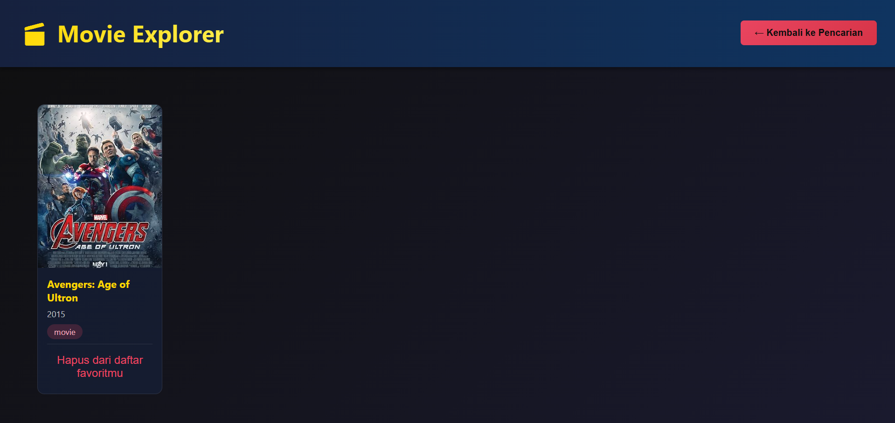

# Movie Explorer

**Nama:** Andika Rahman Pratama<br>
**NIM:** 123140090

## 📚 Deskripsi Proyek

Movie Explorer adalah aplikasi web untuk mencari film favorit Anda dengan mudah. Aplikasi ini menggunakan **OMDb API** untuk memberikan hasil pencarian yang lengkap. Fitur utama meliputi form pencarian interaktif dan hasil yang detail.
## ✨ Fitur Utama

1. **Form pencarian film dengan input text dan filter tahun**
2. **Tabel hasil pencarian dengan poster, judul, tahun, rating**
3. **Detail film dalam card atau modal saat diklik**
4. **Fitur tambah atau hapus dari daftar favorit menggunakan localStorage**
5. **Responsive grid layout untuk card film**

## 🚀 Cara Instalasi & Menjalankan

### Prerequisites
- Node.js (versi 16 atau lebih tinggi)
- npm atau yarn

### Instalasi

1. Clone repository
```bash
git clone https://github.com/11-090-AndikaRahmanPratama/uts-pemweb-123140090.git
cd uts-pemweb-123140090
```

2. Install dependencies
```bash
npm install
```

3. Jalankan development server
```bash
npm start
```

4. Buka browser dan akses `http://localhost:3000`

## 🔧 Teknologi yang Digunakan

- **Frontend Framework:** React JS (CRA) 
- **Styling:** CSS
- **API:** OMDb API
- **Storage:** localStorage untuk menyimpan daftar film favorit
- **Build Tool:** Vercel (Deployment)

## 📦 API Integration

Aplikasi menggunakan **OMDb API** yang tersedia gratis. 


## 📸 Screenshot Aplikasi

### Halaman Utama


### Hasil Pencarian



## ⚠️ Batasan

- OMDb Search API memiliki rate limiting, pastikan tidak melakukan request terlalu sering
- Data playlist hanya tersimpan di browser lokal (tidak tersinkronisasi antar device)


## LINK DEPLOYMENT
https://uts-pemweb-123140090.vercel.app/


